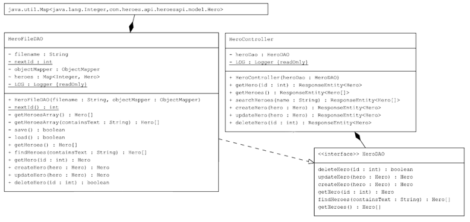
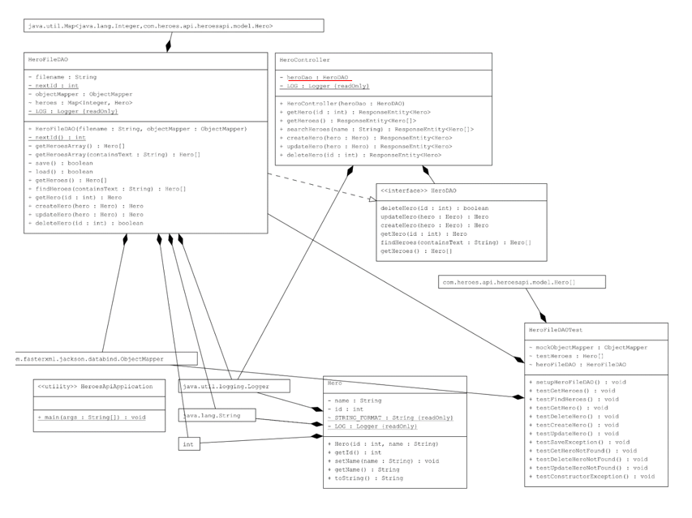
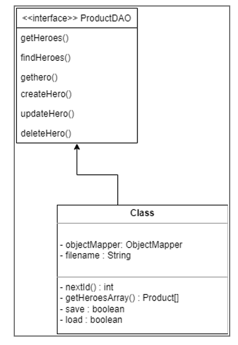

# PROJECT Design Documentation

> _The following template provides the headings for your Design
> Documentation.  As you edit each section make sure you remove these
> commentary 'blockquotes'; the lines that start with a > character
> and appear in the generated PDF in italics._

## Team Information
* Team name: RIT Garage Sale
* Team members
  * Andrew Bush (apb2471)
  * Jacob Karvelis (jak9527)
  * Kelly Showers (kds1653)
  * Zach Brown (zrb8768)
  * Ethan Meyers (epm2875)

## Executive Summary

An online e-store for RIT to sell off many notable landmarks including bricks, various statues from around campus, and decorative trees from lobbies.
Uses a database implementation and includes an auction feature for users to sell their own items on the e-store.

### Purpose

Provide an online store that allows RIT admins to sell the various landmarks and items of interest around campus, including
a place for them to auction off new items.

Seperate authentication for users and admins
As a user I want to be able to search for and add items to my cart so that I may buy them
As an admin I want to be able to edit the inventory of the store so that I can sell products

### Glossary and Acronyms
> _**[Sprint 2 & 4]** Provide a table of terms and acronyms._

| Term | Definition |
|------|------------|
| SPA | Single Page |

## Requirements

This section describes the features of the application.

> _In this section you do not need to be exhaustive and list every
> story.  Focus on top-level features from the Vision document and
> maybe Epics and critical Stories._

### Definition of MVP

An e-store that implements all of the following features:

Minimal Authentication allows for a separation between users and the owner. The owner will not have access 
to a shopping cart and can instead edit and manage inventory.

Customer functionality including customer’s ability to see a list of products and search for a product.

A shopping cart for users to add products to and remove products from. Allows users to proceed to a final checkout
to purchase the products from the shopping cart.

Inventory management allows the e-store owner to add, remove and edit the inventory.

Data Persistence saves everything to files, or in this case a database, that will show previously made 
changes including previous items added to a user’s shopping cart.

A Database implementation to store data about users, carts and items.

An auction feature allowing users to list certain items for auction.

### MVP Features
>  _**[Sprint 4]** Provide a list of top-level Epics and/or Stories of the MVP._

### Enhancements
> _**[Sprint 4]** Describe what enhancements you have implemented for the project._

## Application Domain

This section describes the application domain.

> _**[Sprint 2 & 4]** Provide a high-level overview of the domain for this application. You
> can discuss the more important domain entities and their relationship
> to each other._

The e-shop has an inventory, where all current info about products, prices and quantities are stored.

The owner has control over the inventory of the store, they can add or remove items, update quantities
and create new item listings.

Products can go up for auction, where they can be bid on by customers.

Customers have a unique username used for authentication and differentiation from admins. Customers
can store up to 2 addresses and store their payment methods to pay for items on the e-store that are stored
in their shopping cart.

The shopping cart contains items that customers wish to purchase. Admins do not have access to a shopping cart.
The cart contains a check out button, allowing customers to move to the checkout to make their final purchase.

Customers and Admins log in through the Authenticator, which changes what view the user has.

## Architecture and Design

This section describes the application architecture.

### Summary

The following Tiers/Layers model shows a high-level view of the webapp's architecture.

The e-store web application, is built using the Model–View–ViewModel (MVVM) architecture pattern. 

The Model stores the application data objects including any functionality to provide persistance. 

The View is the client-side SPA built with Angular utilizing HTML, CSS and TypeScript. The ViewModel provides RESTful APIs to the client (View) as well as any logic required to manipulate the data objects from the Model.

Both the ViewModel and Model are built using Java and Spring Framework. Details of the components within these tiers are supplied below.

### Overview of User Interface

This section describes the web interface flow; this is how the user views and interacts
with the e-store application.

> _Provide a summary of the application's user interface.  Describe, from
> the user's perspective, the flow of the pages in the web application._

### View Tier
> _**[Sprint 4]** Provide a summary of the View Tier UI of your architecture.
> Describe the types of components in the tier and describe their
> responsibilities.  This should be a narrative description, i.e. it has
> a flow or "story line" that the reader can follow._

> _**[Sprint 4]** You must  provide at least **2 sequence diagrams** as is relevant to a particular aspects 
> of the design that you are describing.  For example, in e-store you might create a 
> sequence diagram of a customer searching for an item and adding to their cart. 
> As these can span multiple tiers, be sure to include an relevant HTTP requests from the client-side to the server-side 
> to help illustrate the end-to-end flow._

> _**[Sprint 4]** To adequately show your system, you will need to present the **class diagrams** where relevant in your design. Some additional tips:_
 >* _Class diagrams only apply to the **ViewModel** and **Model** Tier_
>* _A single class diagram of the entire system will not be effective. You may start with one, but will be need to break it down into smaller sections to account for requirements of each of the Tier static models below._
 >* _Correct labeling of relationships with proper notation for the relationship type, multiplicities, and navigation information will be important._
 >* _Include other details such as attributes and method signatures that you think are needed to support the level of detail in your discussion._

### ViewModel Tier
> _**[Sprint 4]** Provide a summary of this tier of your architecture. This
> section will follow the same instructions that are given for the View
> Tier above._

> _At appropriate places as part of this narrative provide **one** or more updated and **properly labeled**
> static models (UML class diagrams) with some details such as critical attributes and methods._
> 

### Model Tier

Cart.java: Provides a template for the Cart resource. A cart contains an ID and products, and Cart.java
defines getter functions to get these two pieces of information, as well as a toString() function.

Product.java: Provides a template for the Product resource. A product contains an ID, name, price and quantity.
Within Product.java, the getter functions for this info is defined, along with functions to set the name, price
and quantity of each product.

User.java: Provides a template for the User resourse. A user contains an ID and a username, and User.java
defines functions to get and set both of these fields for each User.

> _At appropriate places as part of this narrative provide **one** or more updated and **properly labeled**
> static models (UML class diagrams) with some details such as critical attributes and methods._
> 

## OO Design Principles

Controller:
Our system implementation uses a simple Controller concept at this time. The controller concept essentially states 
that there should be some controller object that coordinates all system actions and operations, or in more complicated cases,
multiple controller objects that coordinate all related actions and system operations. We are currently just using the Heroes API Spike
code as a base. This very clearly implements the Controller concept. It has an object called HeroController. This class responds to all
user API requests through various methods, one to handle each request. Within these methods, the controller makes calls to the 
other software layers, coordinating them to create the desired results. This shows the concept of Controller because we have one controller
object that is acting to coordinate the system actions for each request. The following diagram shows these relations well:

Injection:
Our system implementation also utilizes the object-oriented concept of Injection. Injection is the concept of creating an
object needed down the line higher up in the hierarchy and injecting that down by passing it in as a parameter.
Our system uses that in a few places, but one notable place shown in the UML diagram below is in the HeroController. 
The heroDAO instance data of the HeroController is injected by the Spring Framework (This is underlined in red in the diagram). 
This means that the HeroController only needs to deal with the higher level abstraction of the HeroDAO without having to 
deal with the implementation specific HeroFileDAO. This is also good for our implementation, as we intend to eventually replace 
the HeroFileDAO with a DatabaseDAO, and this will be easily possible by simply changing what type of thing the Spring Framework 
instantiates. This implementation can also be improved by renaming variables to make them more relevant to our domain. 
We will also need to replace some things to use a database instead of files.

Low Coupling
Low coupling refers to keeping the number of relations within a program to only those that are
necessary. This means eliminating unnecessary or possibly redundant references. In our current
state of our project an example would be that the EstoreController file only imports the
ProductDAO file and not both it and the ProductFileDAO as all the information that the controller
would need from a ProductFileDAO could be obtained from the calls that it has to implement
from the ProductDAO file. A possible future example in our project would be that instead of
having the shopping cart and the E-store have a connection to both the inventory and the product listings
to get each item, descriptions, and how many are left, they could only have a reference to the product 
listings which then could access the inventory counts. This makes it so that by accessing the product 
listings a file can by association have all the information on the listings instead of having to use multiple 
references to gather all the information. Another example of this would be in our listings, as we will have 
both standard listings in addition to auctions. Each of these listings would implement the listing class functions, 
such as get price, get description, etc., which would allow the other parts of the program to only import the 
listing class instead of both the standard listing and auction classes separately.

Open / Closed:
The Open and Closed design principles specifically relate to appropriate use of abstract classes and interfaces 
such that software is “extendable” without the base functions being directly modified. Our code currently 
uses an interface “ProductDAO” (formally HeroDAO), which acts as a blueprint for all the methods that need 
to be defined in any class that implements it. This means that multiple classes can implement it and have 
different implementations, open for extension but closed for modification. Going forward, we can apply this design 
in other parts of our e-store. For instance, when viewing the e-store, an administrator and a customer will have 
different views. It could be worth making an interface or abstract class for a “viewer” which has the same basic 
website view, but the administrator is able to view specific information or abilities to edit products. 

> _**[Sprint 3 & 4]** OO Design Principles should span across **all tiers.**_

## Static Code Analysis/Future Design Improvements
> _**[Sprint 4]** With the results from the Static Code Analysis exercise, 
> **Identify 3-4** areas within your code that have been flagged by the Static Code 
> Analysis Tool (SonarQube) and provide your analysis and recommendations.  
> Include any relevant screenshot(s) with each area._

> _**[Sprint 4]** Discuss **future** refactoring and other design improvements your team would explore if the team had additional time._

## Testing
> _This section will provide information about the testing performed
> and the results of the testing._

### Acceptance Testing
> _**[Sprint 2 & 4]** Report on the number of user stories that have passed all their
> acceptance criteria tests, the number that have some acceptance
> criteria tests failing, and the number of user stories that
> have not had any testing yet. Highlight the issues found during
> acceptance testing and if there are any concerns._

### Unit Testing and Code Coverage
> _**[Sprint 4]** Discuss your unit testing strategy. Report on the code coverage
> achieved from unit testing of the code base. Discuss the team's
> coverage targets, why you selected those values, and how well your
> code coverage met your targets._

>_**[Sprint 2 & 4]** **Include images of your code coverage report.** If there are any anomalies, discuss
> those._