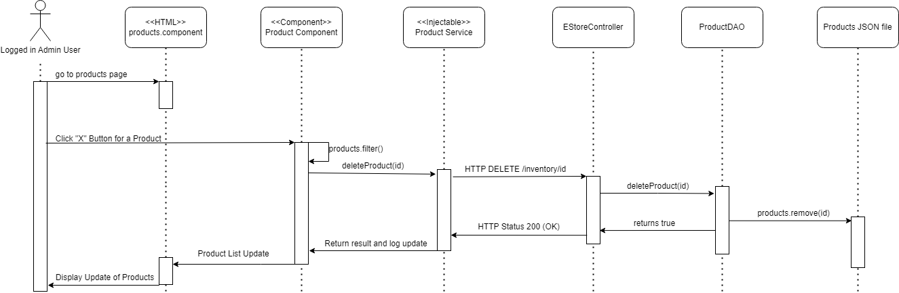

# PROJECT Design Documentation

> _The following template provides the headings for your Design
> Documentation.  As you edit each section make sure you remove these
> commentary 'blockquotes'; the lines that start with a > character
> and appear in the generated PDF in italics._

## Team Information
* Team name: RIT Garage Sale
* Team members
  * Andrew Bush (apb2471)
  * Jacob Karvelis (jak9527)
  * Kelly Showers (kds1653)
  * Zach Brown (zrb8768)
  * Ethan Meyers (epm2875)

## Executive Summary

An online e-store for RIT to sell off many notable landmarks including bricks, various statues from around campus, and decorative trees from lobbies.
Uses a database implementation and includes an auction feature for users to sell their own items on the e-store.

### Purpose

Provide an online store that allows RIT admins to sell the various landmarks and items of interest around campus, including
a place for them to auction off new items.

Seperate authentication for users and admins
As a user I want to be able to search for and add items to my cart so that I may buy them
As an admin I want to be able to edit the inventory of the store so that I can sell products

### Glossary and Acronyms

| Term | Definition | 
|------|------------| 
| MVP | Minimum Viable Product |  
| RIT | Rochester Institute of Technology |  
| SPA | Single Page |  
| API | Application Programming Interface |  
| DAO | Data Access Object |  
| OO | Object Orientated |  
| HTML | HyperText Markup Language |  
| CSS | Cascading Style Sheets |  

## Requirements

This section describes the features of the application.

### Definition of MVP

An e-store that implements all of the following features:

Minimal Authentication allows for a separation between users and the owner. The owner will not have access 
to a shopping cart and can instead edit and manage inventory.

Customer functionality including customer’s ability to see a list of products and search for a product.

A shopping cart for users to add products to and remove products from. Allows users to proceed to a final checkout
to purchase the products from the shopping cart.

Inventory management allows the e-store owner to add, remove and edit the inventory.

Data Persistence saves everything to files, or in this case a database, that will show previously made 
changes including previous items added to a user’s shopping cart.

A Database implementation to store data about users, carts and items.

An auction feature allowing users to list certain items for auction.

### MVP Features
* Epic: Shopping Cart
* Epic: Purchase Product
* Epic: Basic Frontend
* User Authentication
* Admin Authentication
* Epic: Inventory Management
* Product List
* User Checkout

### Enhancements

Our two enhancements were the use of a database, and the inclusion of an auction house.

### __Auction House__
The auction house lists one product that is up for auction. The admin can decide the product to list, the starting 
bid, and the date and time at which the auction should end. After the auction is saved, it immediately begins. The
admin cannot change any attributes of an auction after it begins to ensure fairness to end users. If the admin could
suddenly just remove a bid from the item, or change the end time, that would be very unfair. The admin can delete
an auction.\
Users can see the item for auction, an image of it, the current top bid and top bidder, as well as a countdown to 
the end time of the auction. Users can place bids, and if their bid is higher than the current leading bid, their
bid will become the leading bid, and they will be the leading bidder. Otherwise, their bid will not be placed.
After the defined end date and time has passed, no more bids can be placed. Upon viewing a completed auction, a user
will see the top bidder listed as the user. If a user stays on the page from before it ended, the page will not 
allow them to place a bid, and upon trying to, the page will update.

### __Mongo Database__
Our project used a database to store some of the necessary data. At the moment, it currently stores all user data.
It is hosted on MongoDB Atlas, a cloud based implementation of MongoDB. It is accessed using a DBDao, which conforms
to the UserDao. Previously, the project used a File based implementation of the UserDao, but the use of an interface
made the switch as painless as possible.\
The use of a database abstracts away some of the storage, and allows parts of the site to operate without the need to
store information locally on the client machine.

## Application Domain

This section describes the application domain.

The e-shop has an inventory, where all current info about products, prices and quantities are stored.

The owner has control over the inventory of the store, they can add or remove items, update quantities
and create new item listings.

Products can go up for auction, where they can be bid on by customers.

Customers have a unique username used for authentication and differentiation from admins.

The shopping cart contains items that customers wish to purchase. Admins do not have access to a shopping cart.
The cart contains a check out button, allowing customers to move to the checkout to make their final purchase.

Customers and Admins log in through the Authenticator, which changes what view the user has.

## Architecture and Design

This section describes the application architecture.

### Summary

The following Tiers/Layers model shows a high-level view of the webapp's architecture.

The e-store web application, is built using the Model–View–ViewModel (MVVM) architecture pattern. 

The Model stores the application data objects including any functionality to provide persistance. 

The View is the client-side SPA built with Angular utilizing HTML, CSS and TypeScript. The ViewModel provides RESTful APIs to the client (View) as well as any logic required to manipulate the data objects from the Model.

Both the ViewModel and Model are built using Java and Spring Framework. Details of the components within these tiers are supplied below.

### Overview of User Interface

This section describes the web interface flow; this is how the user views and interacts
with the e-store application.

The user first encounters the login page upon coming to the site, from here they cannot move on to another page until first logging in. 
After logging in the navigation bar appears with a dashboard, product list page, a shopping cart (only if not an admin user), and login page 
button, each which takes the user to the respective page. Then on any of the given pages with products listed, if a product item is clicked 
the website takes the user to a details page on that product which still has the navigation bar but also contains a back button which 
redirects the user back to the page where they clicked the product.

### View Tier
> _**[Sprint 4]** Provide a summary of the View Tier UI of your architecture.
> Describe the types of components in the tier and describe their
> responsibilities.  This should be a narrative description, i.e. it has
> a flow or "story line" that the reader can follow._

> _**[Sprint 4]** You must  provide at least **2 sequence diagrams** as is relevant to a particular aspects 
> of the design that you are describing.  For example, in e-store you might create a 
> sequence diagram of a customer searching for an item and adding to their cart. 
> As these can span multiple tiers, be sure to include an relevant HTTP requests from the client-side to the server-side 
> to help illustrate the end-to-end flow._

> _**[Sprint 4]** To adequately show your system, you will need to present the **class diagrams** where relevant in your design. Some additional tips:_
 >* _Class diagrams only apply to the **ViewModel** and **Model** Tier_
>* _A single class diagram of the entire system will not be effective. You may start with one, but will be need to break it down into smaller sections to account for requirements of each of the Tier static models below._
 >* _Correct labeling of relationships with proper notation for the relationship type, multiplicities, and navigation information will be important._
 >* _Include other details such as attributes and method signatures that you think are needed to support the level of detail in your discussion._

__Components__

Our components in the project allowed for us to separate out the different diplay elements for the website and therefore if changes happened only the affected elements would need to be refreshed. Of these components the one that were key to our website included the auction, cart, checkout, login, product-detail, product-search, products, and the main app component. The auction component holds a pontential auction and manages its creation and destruction as well as user bids. The cart displays the current user's cart and lets the user modify the quanities. The checkout page requires the user to enter their information and removes the bought items from the inventory. Login component manages the current user and the process of logining in and out. The product detail component diplays the information on a product and allows admins to edit this info. Product search gives users the option to search the listings of products to find what they are looking for. The products component diplays the list of products. Finally the main app component provides the base page on which all other components are displayed on. 

__Services__

For the services in our project, they allowed us to use function calls to request data, send, or update data in the backend through processes in the frontend components. Each of our services were made specifically for a controller aside from our message service which was used for debugging purposes. The first of these was the product service which allowed the frontend to be able to manage the products and their information in the store. The next was the user service which let the frontend add new users and see if a user was already made. The current user service let the frontend know which user was currently logged in and also allowed it to set that user. The cart service let the frontend store a users cart, get their previous cart, or checkout. Finally the auction service let the frontend add or remove an auction, update the bidder on the current auction, or check the ending time of the auction. Overall these services let the frontend make requests or push data to the back end and have the back end respond accordingly all without either knowing the format of the other.

Here are the sequence diagrams displaying some of the functionality from the view tier. 

### ViewModel Tier

The ViewModel tier in our project contains the RestAPI controllers.

__Rest API Controllers__

To uphold maintainability and expandability as much as possible, the Rest API Controller portion of the ViewModel tier was split down into many controllers, rather than just one. Each controller corresponds to a different part of functionality for the site. This allows for easy extensions and easily adding more functionality. There are controllers to handle requests for: Auctions, Carts, CurrentUsers, Users, and Products. Each handles specifically their own kinds of objects, and no others. Some do need to have access to the model tier for pieces unrelated to themselves. For example, the Cart Controller has a DAO for carts, but also for Products, to allow for updating products in carts to match the storefront. More information on this and these choices can be found in the section for Adherence to Object Oriented Design Principles. Below we have included a list of all controllers, and their functionalities. Images and class diagrams for these can be found in the section for Adherence to Object Oriented Design Principles.

__EStoreController__: Handles API requests for products. Has methods to handle Get all products, get a particular product, get products with a name containing a specific string (search), creating new products, updating a product, and deleting a product.

This controller needs only a ProductDAO to function.

__UserController__: Handles API requests for users. This has methods for getting a User by name, and creating a user with a particular name. 

This controller needs only a userDAO to function

__CurrentUserController__: Handles API requests to handle session management. Has methods for setting the current user, getting the current user, and removing the current user.

This controller needs only a currentUserDAO to function.

This controller serves to handle sessions. These are stored in the backend as a workaround to some issues we had in supporting it through the frontend. It also allows for maintaining the session through a page refresh, despite the single page nature of Angular.

__CartController__: Handles API requests to handle cart mangement. This has methods for getting a cart, creating a new cart, adding a product to a cart, updating the count of a product in the cart, removing a product from the cart, checking out (removing all products from the cart), and updating the products with regard to those in the inventory in order to maintain consistency.

This requires both a CartDAO and a ProductDAO. The CartDAO goes without saying, and the ProductDAO is needed specifically for the updateProducts method. It is required so that the cart controller can know about the products in inventory in order to know what it is updating against.

__AuctionController__: Handles API requests to handle auctions. This has methods for getting the currently running auction, creating an auction, deleting an auction, placing a bid, and checking if the auction is over.

This controller needs only an AuctionDAO.

These controllers frequently make use of path variables for ease of use in the frontend, and to reduce the need to create objects in typescript. We found that handling objects and working with them in the frontend could be very cumbersome, so we chose to reduce the amount of requestBodies that our API requests use. This did result in some strange design quirks though. Some methods, such as auctionOver, needed a dummy path variable. This was because it needed to be differentiated from the getAuction request, as both of these requests are gets with no specific information.

### Model Tier

Cart.java: Provides a template for the Cart resource. A cart contains an ID and products, and Cart.java
defines getter functions to get these two pieces of information, as well as a toString() function. It also contains a "total" value, which is just the sum of all the values of the products in the cart.

Product.java: Provides a template for the Product resource. A product contains an ID, name, price and quantity.
Within Product.java, the getter functions for this info is defined, along with functions to set the name, price
and quantity of each product.

User.java: Provides a template for the User resource. A user contains an ID and a username, and User.java
defines functions to get and set both of these fields for each User.

CurrentUser.java: Provides a template for a current user resource. This was necessary for database implementation due to some limitations of MongoDB.

Bid.java: Provides a template for bid items, storing a username and a bid amount. This was not strictly necessary but allowed for cleaner and more readable code. Easily maintainable and modifiable if bids ever need to hold more information.

AuctionItem.java: Provides a template for Auctions. It holds all necessary info including the end time, the product for auction, the current max bid, and the id of the auction. IDs were only included for potential future extensions to allow multiple auctions. The class also provides all necessary setters and getters.

## OO Design Principles

Controller:
Our system implementation uses a more complex controller setup compared to the last sprint. The controller concept essentially 
states that there should be some controller object that coordinates all system actions and operations, or in more complicated 
cases, multiple controller objects that coordinate all related actions and system operations. We have a few separate controller 
classes. First, we have the ProductController. This class responds to all admin API requests that relate to product management 
through various methods, one to handle each request. Within these methods, the controller makes calls to the other software 
layers, coordinating them to create the desired results. This shows the concept of Controller because we have one controller 
object that is acting to coordinate the system actions for each request. The following diagram shows these relations well:

We also have similar controllers for managing user creation and access, cart creation, access, and modification, a controller for managing and creating auctions, and 
a controller managing the current user. Each of these serves similar purposes for their respective domains. They 
handle API requests to the particular kind of object being manipulated. Diagrams for each of those are shown below.

Injection:
Our system implementation also utilizes the object-oriented concept of Injection. It utilized it in Sprint 1, 
but here it has become even more important. Injection is the concept of creating an object needed down the line 
higher up in the hierarchy and injecting that down by passing it in as a parameter.  Our system uses that in 
quite a few places, notably, injection is used in each controller class. The respective DAO instance data of 
each controller is injected by the Spring Framework (This is underlined in red in the diagrams below, one for 
each controller). This means that the controllers only need to deal with the higher level abstraction of the DAOs 
without having to deal with the implementation specific DAOs. This is also good for our implementation, as we intend 
to eventually replace the FileDAOs we are currently using with DatabaseDAOs, and this will be easily possible by simply 
changing what type of thing the Spring Framework instantiates. In our typescript files our angular components take the user 
service files as injections in order to have them handle the backend calls for them. This shows how our other software 
layers, like our frontend angular app, also adhere to object oriented concepts.

Low Coupling:
Low coupling refers to keeping the number of relations within a program to only those that are
necessary. This means eliminating unnecessary or possibly redundant references. An example would be that the 
EstoreController file only imports the ProductDAO file and not both it and the ProductFileDAO as all the 
information that the controller would need from a ProductFileDAO could be obtained from the calls that it has to 
implement from the ProductDAO file. Another example is that the CartController has a CartDAO, and a ProductDAO. 
Although this is coupling, this coupling is necessary for keeping the program bug free. The CartDAO needs to be able to update the carts with regards to the inventory so that there is never any bug there. This still shows minimal coupling because it is the absolute minimal coupling necessary for keeping the product bug free.
It has the minimal coupling to the Product object type, because it does need to know what a product is. This coupling is 
kept minimal by the frontend cleverly using the available information to keep the state consistent. Another example in our 
project is that any controllers that have to do with users do not use any other DAOs besides the UserDAOs. The user controller does not need to know what a product is or what a cart is at all, so there is no need to couple those objects. This is because the frontend can decide the logic of creating equal numbers of carts and users, the DAOs need only keep the ids consistent. A diagram illustrating the coupling between classes is included below.

As shown in the diagram, there is very minimal coupling between classes. The only coupling occurring is that which is absolutely necessary for functionality. Please Zoom in for more detail. You can also refer to the controller class diagrams above, which also show all coupling. As you can see, there is minimal coupling.

Open / Closed:
The Open and Closed design principles specifically relate to appropriate use of abstract classes and interfaces such 
that software is “extendable” without the base functions being directly modified. Our code implements this in a few 
places throughout the backend. All of the implementations are fairly similar, and relate to the various DAOs. For 
example, the ProductDAO is an interface which any concrete implementation must implement. It acts as a blueprint for 
all necessary methods any ProductDAO must have to be functional. Similarly, the UserDAO, CurrentUserDAO, and CartDAO 
interfaces define what behaviors any concrete implementations of them must have. This lets them be closed to modification, 
but open for easy extension.

## Static Code Analysis/Future Design Improvements

This error came from our testing being rushed and is simply an incomplete test this would be fixed if given more time and the test would simply get implemented.

The issues here were mostly lacking the understanding of how the interaction here works in order know whether or not these could be static on creation and when we saw these could be changed, we had much more pressing work and ran out of time.

Did not know what the default constructor was and so given our limited time were not able to look into this.

This was an issue due to our test cases being rushed and therefore functionality was prioritized over proper usage and again did not have the time to go back and change this.

__Future Improvements__\
If we had more time an extension to the functionality of the database would be the next step to ensure everything is kept the same across all systems running the store.

We would also add functionality to check the user entered data on the checkout page to make sure it conforms to the required format. We would also like to store this info on the user's account for ease of checkout.

Another thing we would have liked to have done is made it easier for the admin to set the end time on the auction house. At the moment it is slightly unintuitive, and we would like to make it easier to use.

## Testing

### Acceptance Testing
Sprint 2: 19 stories complete including stories related to the cart and user authentication in both front end and back end.
All stories have been tested and all have passed their acceptence criteria.
Sprint 3: 12 stories completed, including major bug-fixes and major rewrites to the code. 64 story points. All completed stories passed their acceptance criteria.

### Unit Testing and Code Coverage
Our unit testing strategy was to improve code coverage as much as possible to ensure that our functions were correctly
implemented, this included getting as many files as possible in the code base to 85-95% to achieve a goal of 90% overall
code coverage. This was chosen due to being the right balance of attainable with the given time limits of a sprint while
still properly testing enough of our systems to be reliable. Unfortunately our code coverage came well short of our 
90% target depsite our best efforts to ensure that we tested as much as possible. The api currently sits at 77% overall 
due primarily to the Auction class that was implemented late in sprint 3. If the Auction class was able to be 
tested more I believe our overall code coverage could have been much higher. There was also a set of tests that never
got merged into the final release for sprint 4, further dropping our code coverage score.

CartFileDAO has low branch coverage because tests were not created for one function within due to
very low overall usage of the function.

